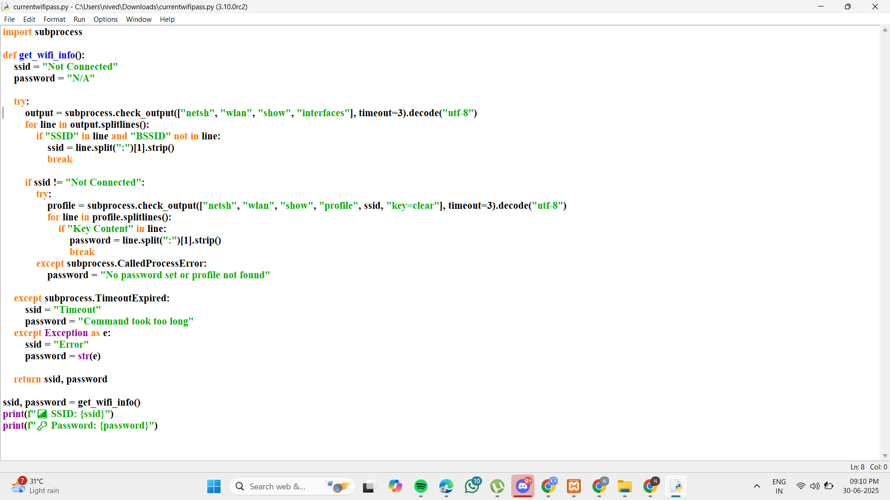
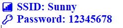
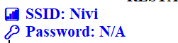

# program file

# program code 

# sample output 1

# sample output 2

## About Wi-Fi Password Checker

The **Wi-Fi Password Checker** is a simple Python script designed to help users retrieve the **Wi-Fi password** of the network they are currently connected to. 
This tool is useful if you have forgotten your Wi-Fi password but are still connected to the network. The script works on **Windows** systems and uses the built-in **`netsh`** command to query network details.

### Features:
- Retrieves the **SSID** (Wi-Fi network name) of the network you are currently connected to.
- Attempts to retrieve the **password** of the Wi-Fi network (if it's saved in your system).
- Provides an easy-to-read output with the SSID and password.
  
### How It Works:
1. The script checks your system for the active Wi-Fi connection using the `netsh wlan show interfaces` command.
2. If connected to a network, it retrieves the SSID and searches for the corresponding saved Wi-Fi password using `netsh wlan show profile`.
3. The password is displayed on the screen if found, allowing you to recover it.
4. If no password is found or the system is not connected to Wi-Fi, an appropriate message is shown.

### Use Cases:
- **Forgotten Wi-Fi password**: If you’re connected to a Wi-Fi network but have forgotten the password, this tool can help you retrieve it.
- **Wi-Fi management**: Ideal for network administrators or anyone who needs to quickly view the credentials for connected networks.

### Limitations:
- This script can only retrieve passwords for Wi-Fi networks that have previously been saved on your computer.
- It works only on **Windows** systems, as it uses `netsh`, a Windows-specific tool.
